# Targama · Relatório de progresso

Registro do que foi melhorado, com prints reais do app rodando. Formato de conversa pra ficar fácil de acompanhar.

---

### 1. Deixei a chave da tradução segura e troquei pra IA da OpenAI

**mattew:** oi natalia bom dia

**mattew:** primeira entrega ja ta de pe

**mattew:** lembra que a chave do tradutor tava exposta no navegador

**mattew:** agora a traducao passa por um servidor meu e a chave fica escondida

**mattew:** e aproveitei pra trocar o motor de traducao pra ia da openai

**mattew:** repara que o cabecalho ja mostra tradutor com tecnologia openai

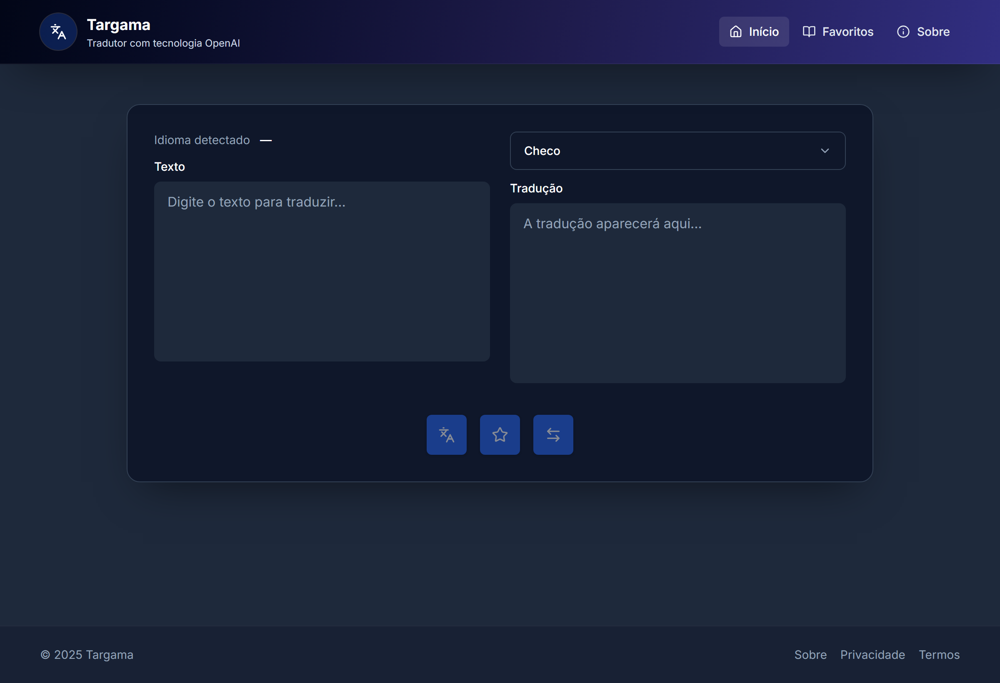

**natalia:** nossa ficou com a mesma cara

**natalia:** e a chave segura era o que mais me preocupava

**natalia:** aprovado

---

### 2. Tradução funcionando de verdade

**mattew:** aqui ela traduzindo ao vivo

**mattew:** digitei uma frase em ingles e ele detectou sozinho o idioma

**mattew:** ja traduziu na hora enquanto eu digitava

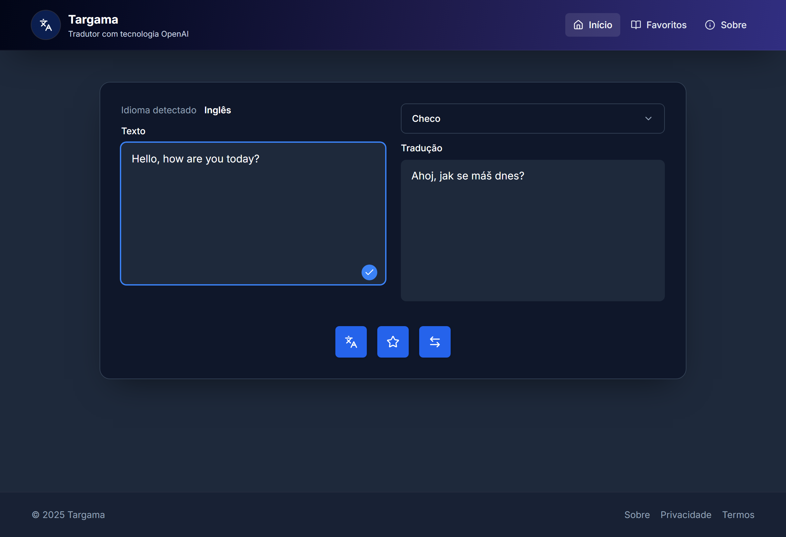

**natalia:** testei aqui tambem

**natalia:** ta bem rapido e o texto ficou natural

**natalia:** gostei demais

---

### 3. Favoritos agora na nuvem

**mattew:** os favoritos sairam do navegador e foram pro banco de dados

**mattew:** a ideia e que depois vc veja eles em qualquer aparelho

**mattew:** essa e a tela quando ainda nao tem nada salvo

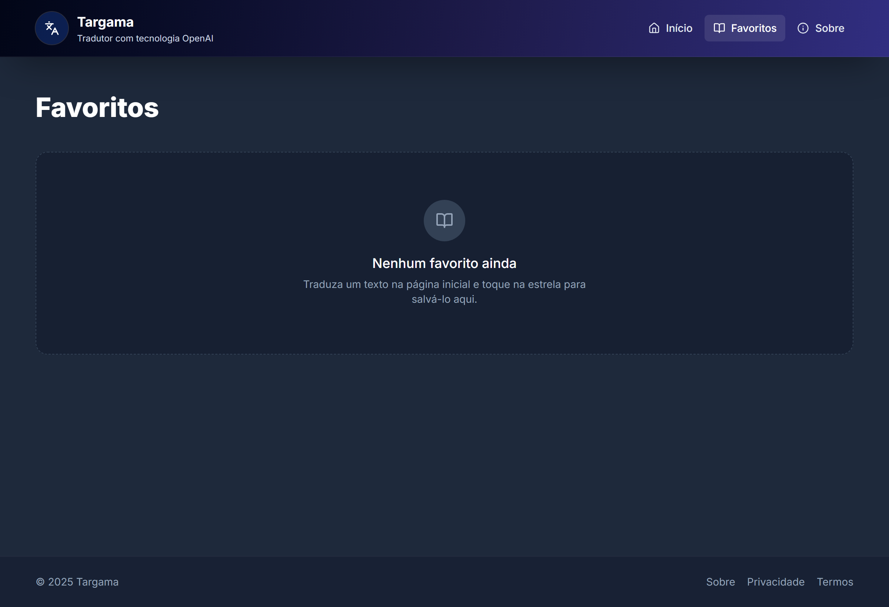

**natalia:** massa

**natalia:** entao nao perco mais os favoritos se trocar de celular

**mattew:** exato

**mattew:** so falta eu ligar a tabela no supabase pra comecar a guardar

**mattew:** te passo o passo a passo disso

---

### 4. Página sobre atualizada

**mattew:** atualizei a pagina sobre pra refletir tudo isso

**mattew:** agora fala de traducao por ia e favoritos sincronizados

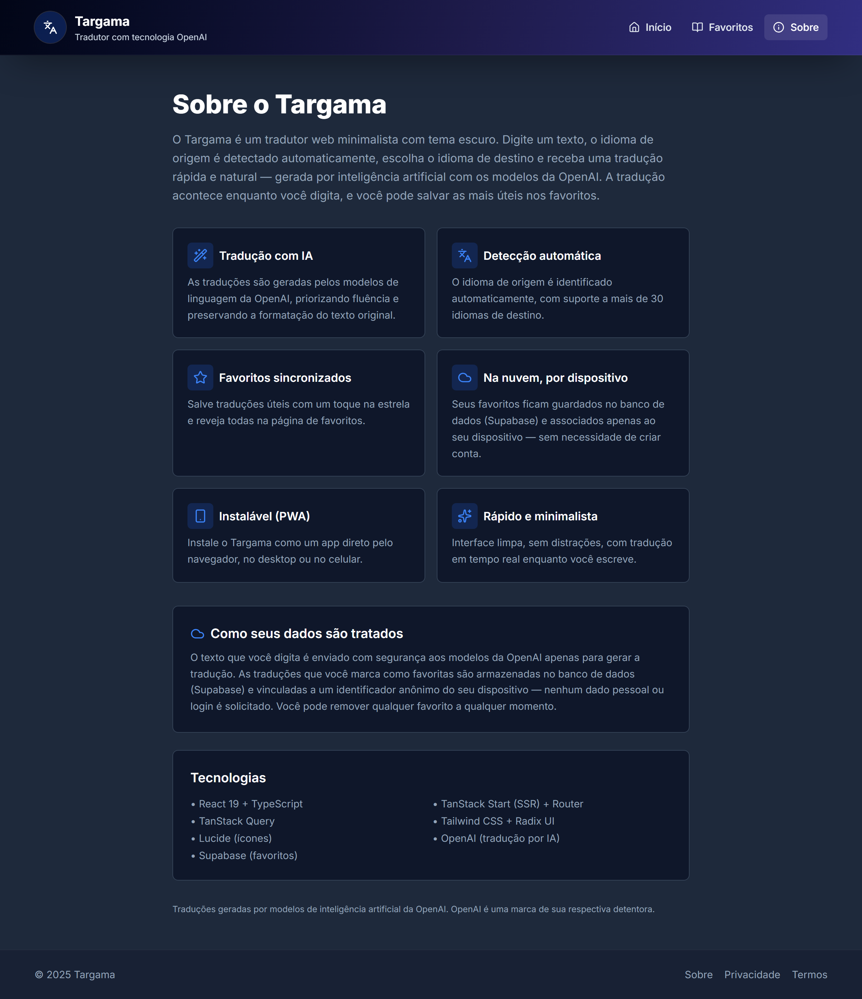

**natalia:** ficou bem informativo

**natalia:** e no mesmo estilo

---

### 5. Páginas legais novas

**mattew:** montei a politica de privacidade e os termos de uso

**mattew:** coloquei tudo no mesmo tema escuro e com link no rodape

**mattew:** o texto e uma base clara mas vale um advogado revisar depois

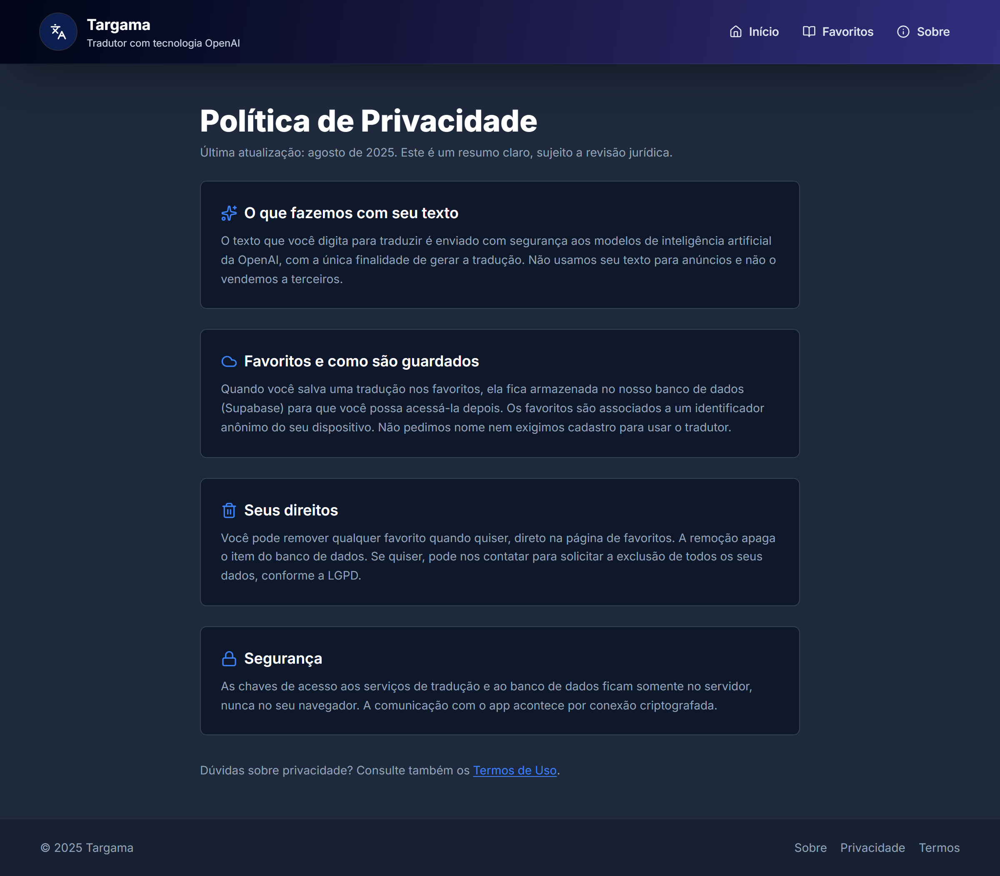

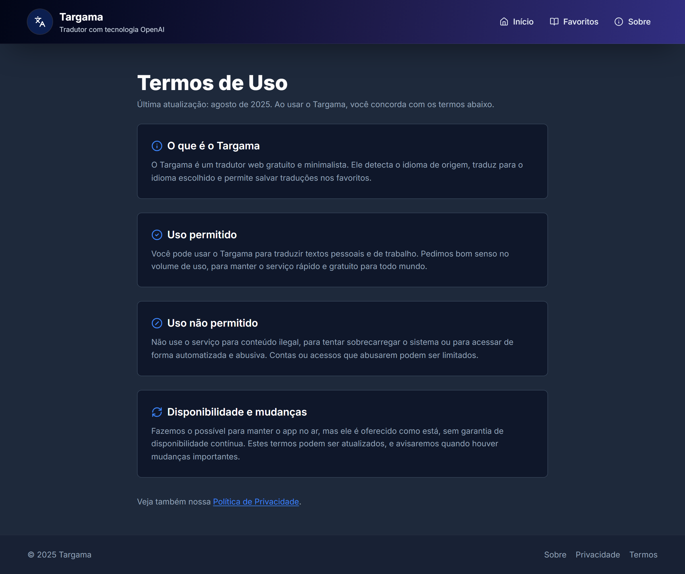

**natalia:** eu nem sabia como comecar isso

**natalia:** ja me ajudou muito ter uma base

**natalia:** deixo um advogado dar uma olhada com calma

---

### 6. Tudo responsivo no celular

**mattew:** e continua leve e responsivo no celular

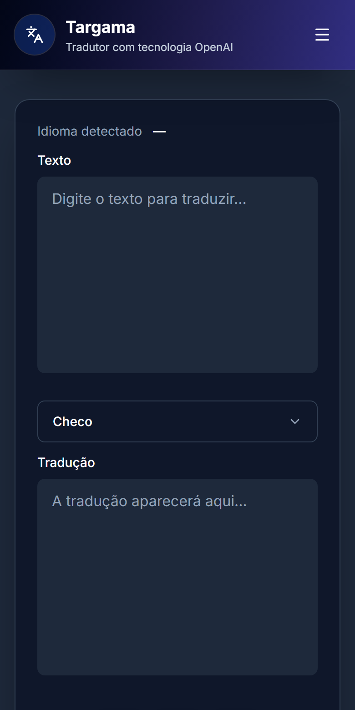

**natalia:** abri no meu telefone e ficou otimo

**natalia:** ta indo muito bem mattew

---

---

### 7. Telas de cadastro e login prontas

**mattew:** comecei a parte de contas

**mattew:** ja deixei as telas de criar conta e de entrar prontas

**mattew:** tudo no mesmo tema escuro e com o botao entrar la no topo

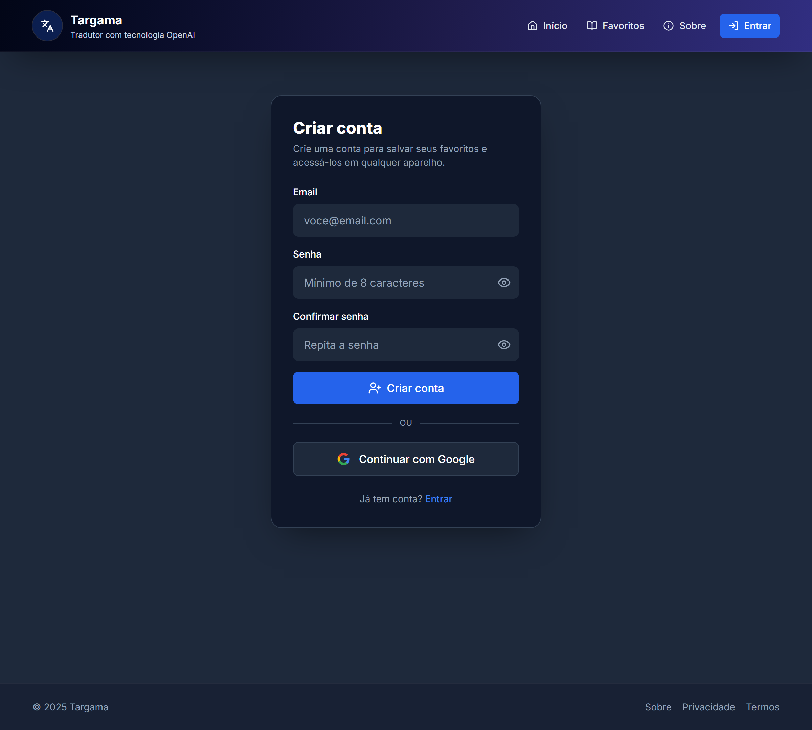

**mattew:** e ja coloquei a validacao no cliente

**mattew:** se a pessoa erra o email ou as senhas nao batem ela avisa na hora

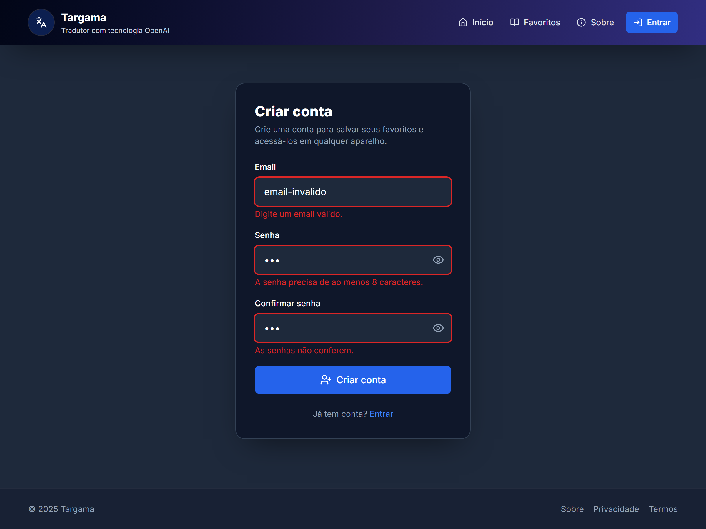

**mattew:** aqui a tela de entrar com o link de esqueci a senha

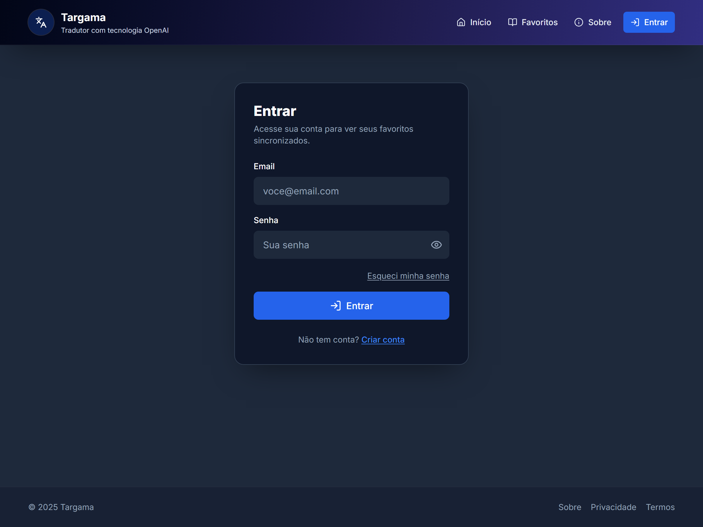

**natalia:** nossa ficou lindo e com a mesma cara

**natalia:** gostei que ja avisa o erro na hora

**mattew:** exato

**mattew:** o proximo passo e ligar isso no supabase pra criar a conta de verdade

**mattew:** pra isso vou precisar de uns ajustes rapidos no painel com vc

**natalia:** pode contar comigo

---

---

### 8. Recuperar senha, perfil e opção do Google

**mattew:** oi natalia mais novidades

**mattew:** montei a tela de recuperar senha

**mattew:** a pessoa poe o email e recebe um link pra criar senha nova

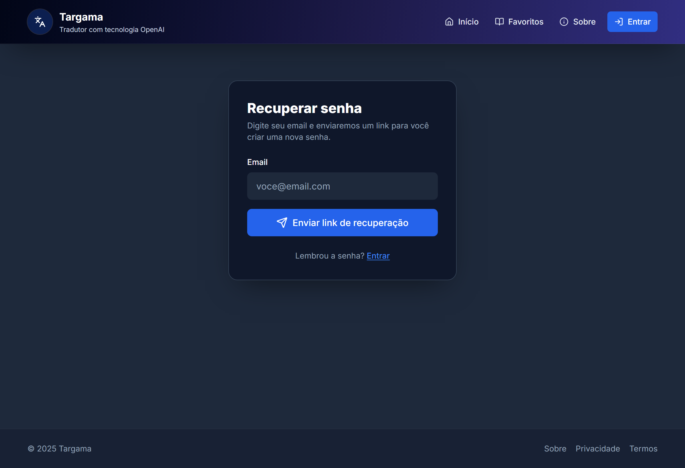

**mattew:** e ja deixei um botao de continuar com google nas telas de conta

**natalia:** aee o google eu queria mesmo

**mattew:** entao ja deixei o botao pronto

**mattew:** ligo ele numa etapa extra com suas credenciais

**mattew:** e fiz a pagina de perfil

**mattew:** da pra trocar a senha e apagar a conta

**mattew:** o apagar tem confirmacao pra ninguem apagar sem querer

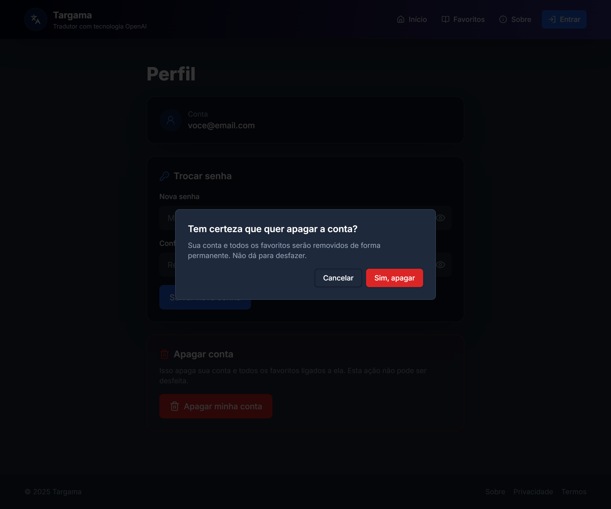

**natalia:** que capricho

**natalia:** e apaga tudo mesmo

**mattew:** apaga a conta e os favoritos ligados nela por causa da lgpd

**natalia:** perfeito ta indo muito bem

---

---

### 9. Limite diario para visitante e redefinir senha

**mattew:** oi natalia implementei o limite de traducoes

**mattew:** quem nao ta logado tem 10 traducoes gratis por dia

**mattew:** e o app mostra quantas faltam

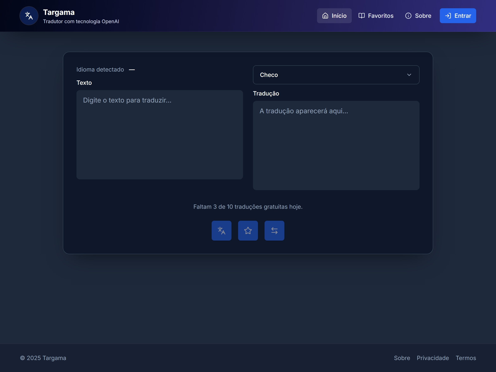

**mattew:** quando acaba aparece um convite pra criar conta

**mattew:** nada agressivo so um empurraozinho

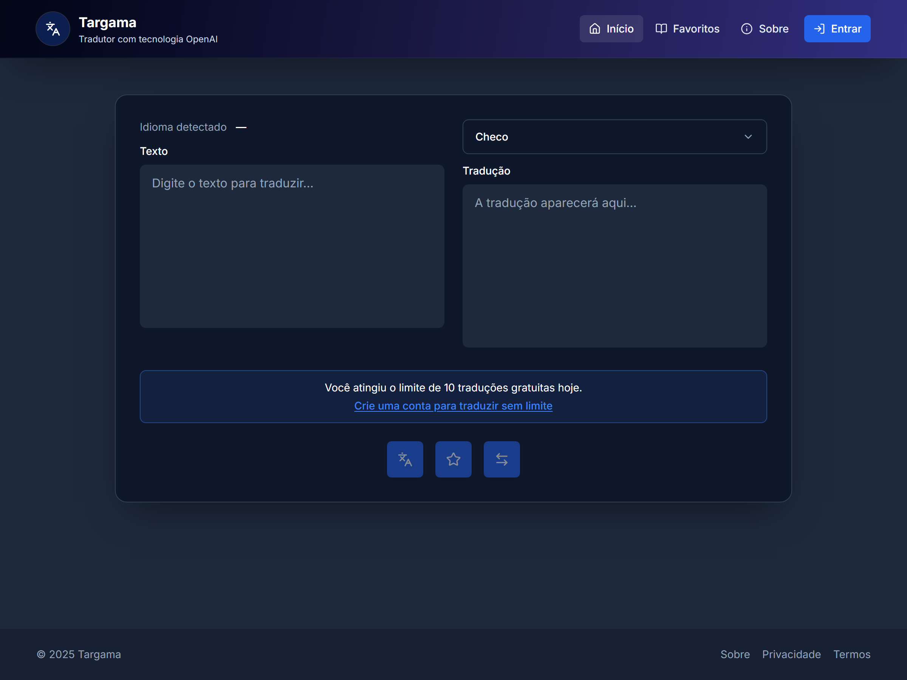

**natalia:** adorei que mostra quantas faltam

**natalia:** e o texto ficou gentil

**mattew:** exato e a contagem zera todo dia

**mattew:** quem cria conta traduz sem limite

**mattew:** e fechei a tela de redefinir senha

**mattew:** e a tela que abre quando a pessoa clica no link do email

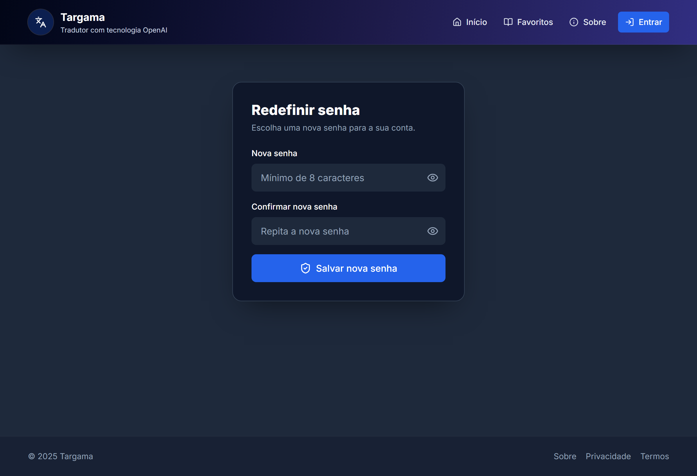

**natalia:** show agora o fluxo de senha ta completo

---

## O que ja esta pronto

- Chave da traducao protegida no servidor
- Traducao por ia da openai com deteccao automatica
- Favoritos migrados para o banco de dados na nuvem
- Botao de inverter idiomas refinado
- Pagina sobre atualizada
- Politica de privacidade e termos de uso
- Telas de cadastro e login com validacao no cliente
- Tela de recuperar senha
- Pagina de perfil com trocar senha e apagar conta com confirmacao
- Botao de continuar com google nas telas de conta
- Limite de 10 traducoes gratis por dia para visitante com contador
- Tela de redefinir senha
- Layout responsivo e pwa mantidos

## Proximos passos

- Ligar a tabela de favoritos no supabase para comecar a guardar os dados
- Conectar cadastro login recuperar senha e perfil ao supabase de verdade
- Confirmacao de email no cadastro
- Favoritos ligados a conta e sincronizados entre aparelhos
- Mover o limite diario para o servidor quando o login estiver ligado
- Ligar o login com google com as credenciais
- Favoritos ligados a conta e sincronizados entre aparelhos
- Limite de traducoes por dia para visitante
- Perfil com trocar senha e apagar conta
- Login com google como etapa extra
